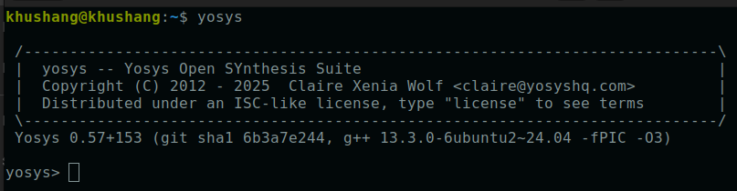
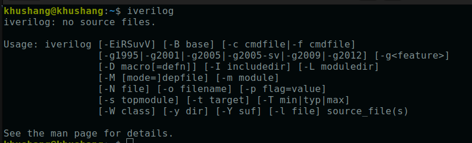
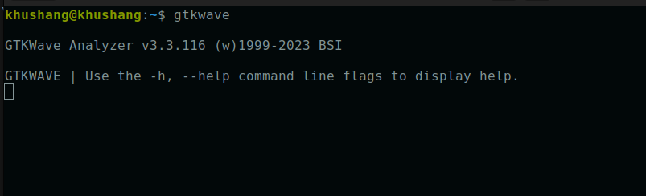
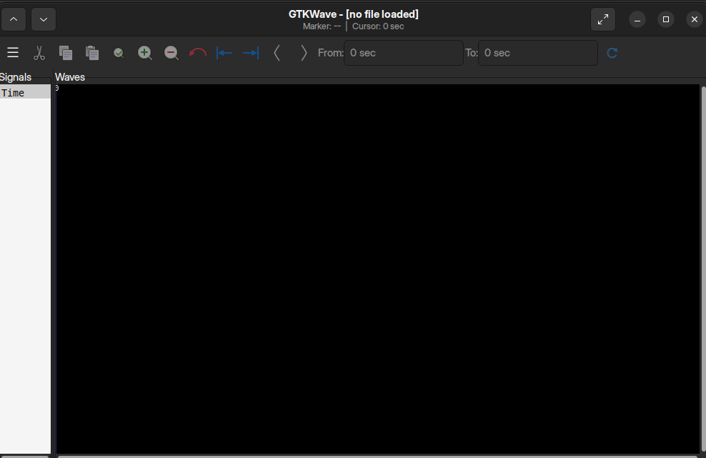

## Summary

- SoC design flow begins with **application validation in C** to ensure correctness.  
- **RTL modeling and simulation** verify hardware functionality against the software model.  
- **Physical design (RTL→GDS)** produces the GDSII file, leading to tape-out and silicon fabrication.  
- After tape-out, the chip is tested with peripherals.  
- The designed processor can be deployed in real-world applications such as **Arduino boards, TV panels, and embedded systems**.  
- Learned how to install essential tools: **Yosys** (synthesis), **GTKWave** (RTL simulation), and **iVerilog** (RTL coding).  

**System Requirements**:  
- 6GB RAM, 50GB HDD  
- Ubuntu 20.04+  
- 4vCPU  

---

## Tool Installation Guide

## **1.Yosys**

```bash
sudo apt-get update
git clone https://github.com/YosysHQ/yosys.git
cd yosys
sudo apt install make      # Install make if not already installed
sudo apt-get install build-essential clang bison flex \
 libreadline-dev gawk tcl-dev libffi-dev git \
 graphviz xdot pkg-config python3 libboost-system-dev \
 libboost-python-dev libboost-filesystem-dev zlib1g-dev
make config-gcc
make
sudo make install
```

**RESULT**



## **2.iVerilog**
```bash
sudo apt-get update
sudo apt-get install iverilog
```

**RESULT**



## **3.GTKwave**
```bash
sudo apt-get update
sudo apt install gtkwave
```

**RESULT**



